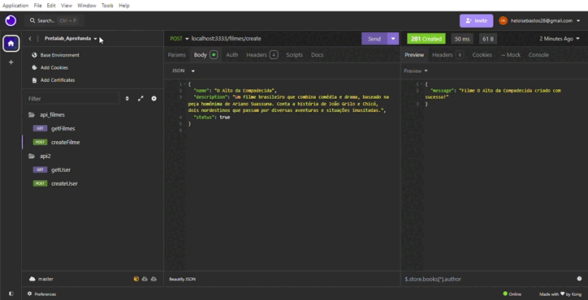
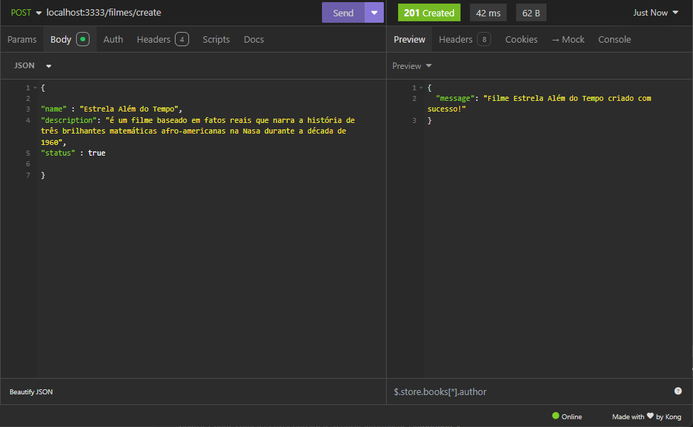
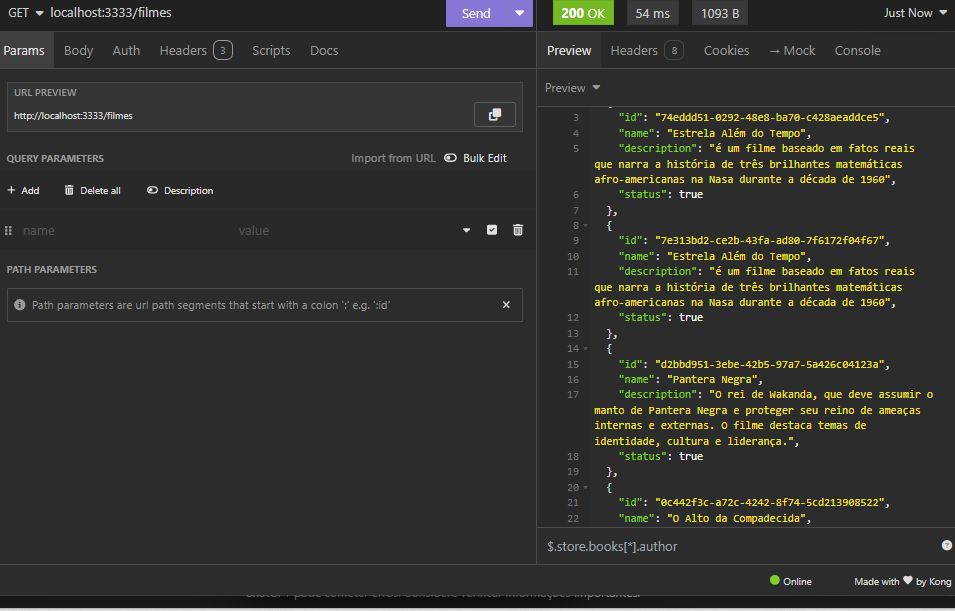

# API de Filmes

## Descrição

O projeto API Filmes é uma aplicação desenvolvida em JavaScript utilizando Node.js e Express para gerenciar uma API simples de filmes. Esta API permite realizar operações básicas criar e ler um conjunto de dados de filmes armazenados temporariamente na memória da aplicação.



## Tecnologias, Framework e Ferramentas

- [JavaScript](https://www.javascript.com/)
- [Node.js](https://nodejs.org/en)
- [Express](https://expressjs.com/)
- [Insomnia](https://insomnia.rest/download)
- [IDE VSCODE](https://code.visualstudio.com/download)

### Testando a API Filmes

Os passos necessários para testar localmente são:

- Instalar as ferramentas necessárias
- Clonar o projeto
- Executar o seguintes comandos na raiz do diretório

  instala pacotes do framework Express e do Nodemon para reiniciar automaticamente o servidor.
  ```plaintext
    npm i express nodemon
   ```
  instala o Cors pacote que gerencia permissões de acesso ao recurso do servidor.
  ```plaintext
    npm i cors
   ```
  Executa o script start definido no package.json, utilizado para iniciar o servidor. 
  ```plaintext
    npm i start
   ```
- Testar as rotas da API e json com as requisições

### Rotas da API Filmes (/filmes)

| Método | Rota                                | Função                                            |
| ------ | ----------------------------------- | ------------------------------------------------- |
| POST   | /filmes/create                      | Operação de cadastro de novo fime                 |
| GET    | /filmes                             | Operação buscar todos os filmes cadastrados       |


#### [POST] filmes/create

- **Descrição**: Operação de cadastro de novo filme. Requer o envio dos dados do filme pelo body.

- **Exemplo de body**:

```json
{

"title" : "Estrela Além do Tempo",
"description": "é um filme baseado em fatos reais que narra a história de três brilhantes matemáticas afro-americanas na Nasa durante a década de 1960",
"status" : true

}

```


#### [GET] /filmes

- **Descrição**: Operação busca de todos os filme cadastrados

```plaintext
  localhost:3333/filmes
```



## Estrutura do projeto

```plaintext
📂api_filmes
└──📂 node_modules
└──📂 server.js
└──📂 package-lock.json
└──📂 package.json
```
