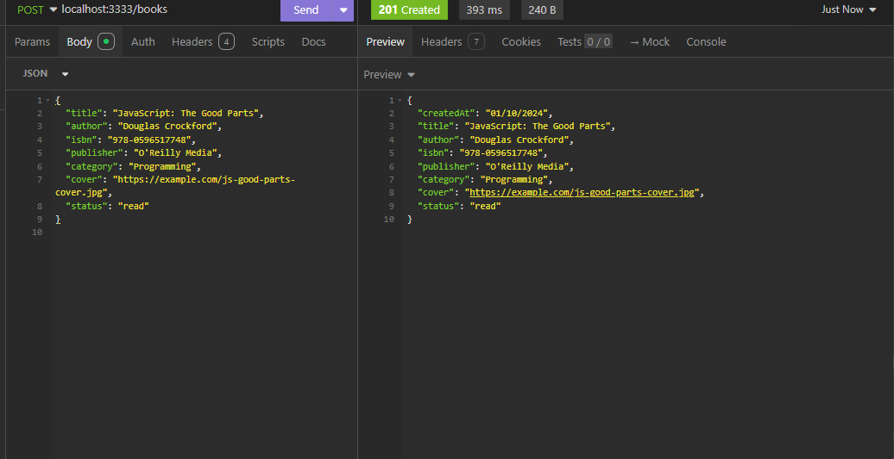
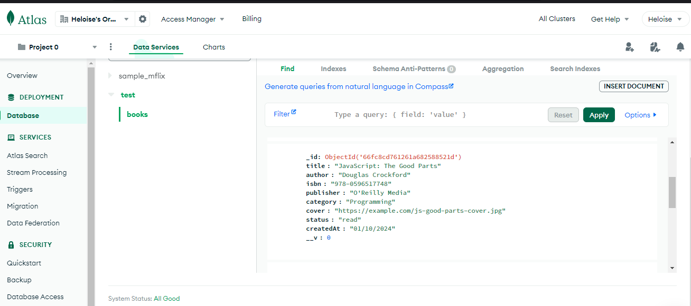
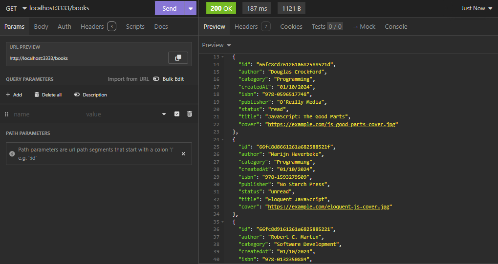
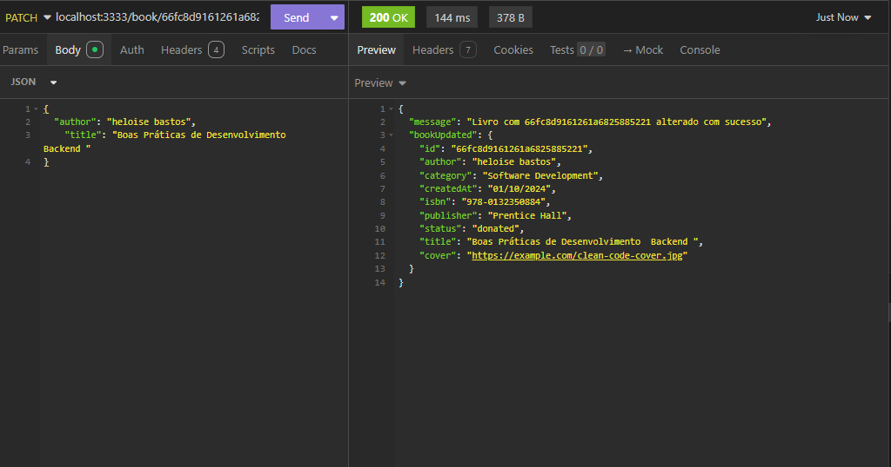
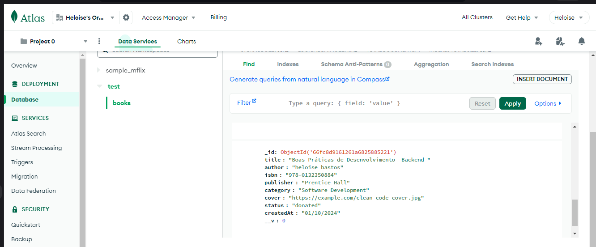
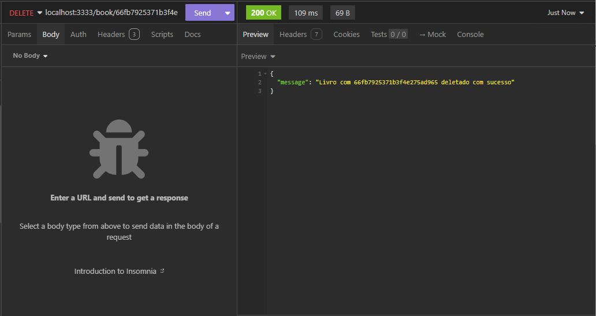

# API LIVROS COM CONEXÃO AO BANCO DE DADOS 

## Descrição

A API Livros foi desenvolvida em TypeScript utilizando Node.js e Express. O objetivo desta atividade é refatorar está API foi para adicionar a conexão ao banco de dados não relacional MongoDB.

## Tecnologias, Framework e Ferramentas

- [Node.js](https://nodejs.org/en)
- [Express](https://expressjs.com/)
- [Insomnia](https://insomnia.rest/download)
- [IDE VSCODE](https://code.visualstudio.com/download)
- [TypeScript](https://www.typescriptlang.org/)
- [MongoDB](https://www.mongodb.com/pt-br)

### Testando a API Reserva de Passagem

Os passos necessários para testar localmente são:

- Instalar as ferramentas necessárias
- Clonar o projeto
- Executar o seguintes comandos na raiz do diretório

  Instalar dependencias que usaremos no projeto

````
npm install typescript ts-node-dev @types/node @types/express
````
 
  Executa o script start definido no package.json, utilizado para iniciar o servidor. 
  ```plaintext
    npm  start
   ```
- Testar as rotas da API e JSON com as requisições

### Rotas da API Post Refatorado 

| Método | Rota                                | Função                                            |
| ------ | ----------------------------------- | ------------------------------------------------- |
| POST   | /books                     | Operação para criar um novo book                 |
| GET    | /books                | Operação buscar todos os books       |
| PATCH    | /book/:id   | Operação para editar um book específico       |
| DELETE    | /book/:id        | Operação para deletar um book especifico       |


#### [POST] /books
- **Descrição**: Operação de cadastro um novo book. Requer o envio dos dados do post pelo body.

```plainttext
localhost:3333/books
```
- **Exemplo de body**:

```json
{
  "title": "JavaScript: The Good Parts",
  "author": "Douglas Crockford",
  "isbn": "978-0596517748",
  "publisher": "O'Reilly Media",
  "category": "Programming",
  "cover": "https://example.com/js-good-parts-cover.jpg",
  "status": "read"
}

```




#### [GET] /books
- **Descrição**: Operação para buscar todos os books cadastrados

```plaintext
localhost:3333/books
```


#### [PATCH] /book/:id

- **Descrição**: Operação para editar um book específica por meio do id cadastrado

```plaintext
 localhost:3333/book/:id
```




#### [DELETE] /delete-reserva-passagem/:id

- **Descrição**: Operação para deletar um book específico por meio do id cadastrado

```plaintext
localhost:3333/book/:id
```


## Estrutura do projeto

```plaintext
📂api-reserva-passage-aerea
└──📂src
    └──📂interface
        └──📄 index.ts
        └──📄book-controller.ts
    └──📂infrastructure
        └──📂database
              └──📄 repository.ts
               └──📄 connection.ts
               └──📄 model.ts
        └──📂utils
              └──📄 config.ts
    └──📂applications
         └──📂repositories
            └──📄book-repository.ts
         └──📂use-cases
            └──📄create-book-use-case.ts
            └──📄delete-book-use-case.ts
            └──📄list-all-books-use-case.ts
            └──📄update-book-use-case.ts
    └──📂domain
        └──📄book.ts
└──📂node_modules
└──📄 package-lock.json
└──📄 package.json
└──📄 .tsconfig.json
└──📄 .jest.config.js
└──📄 .gitigonore
└──📄 Readme.md
