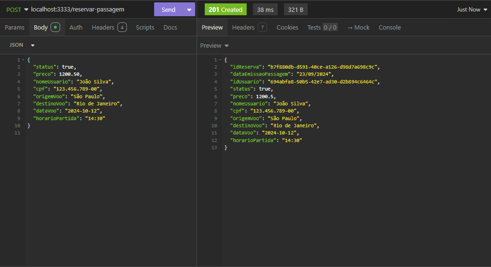
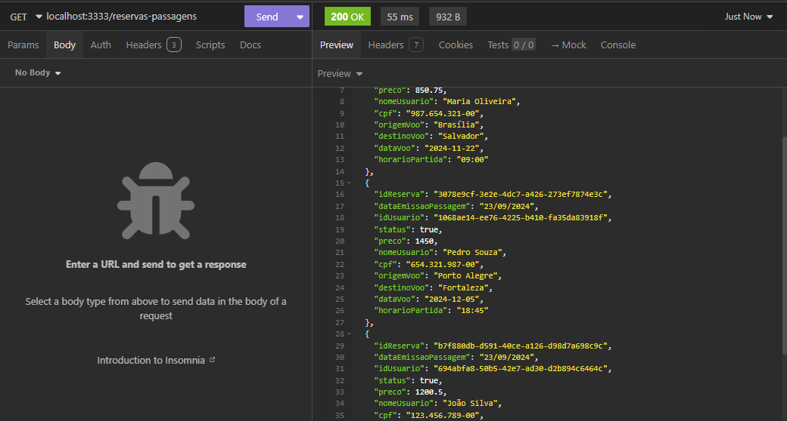
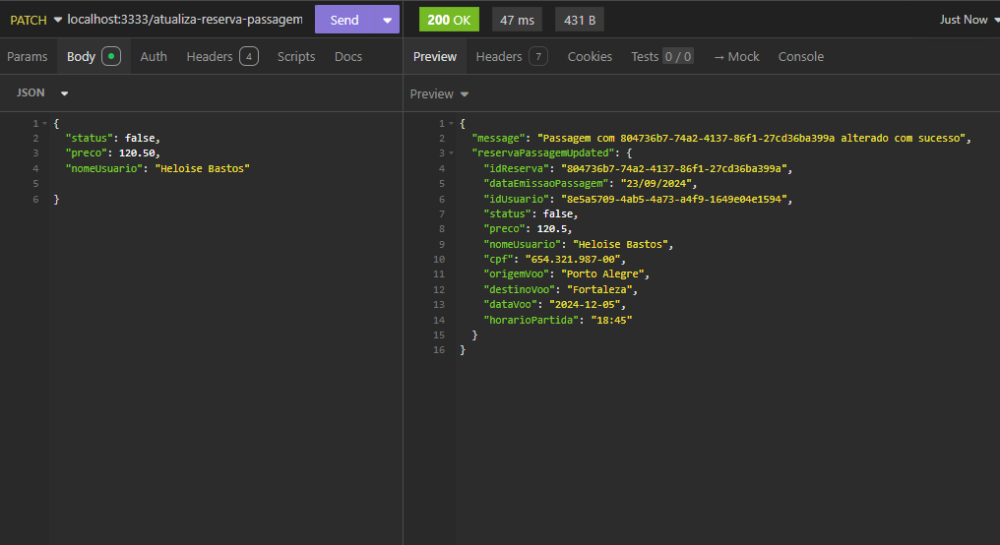
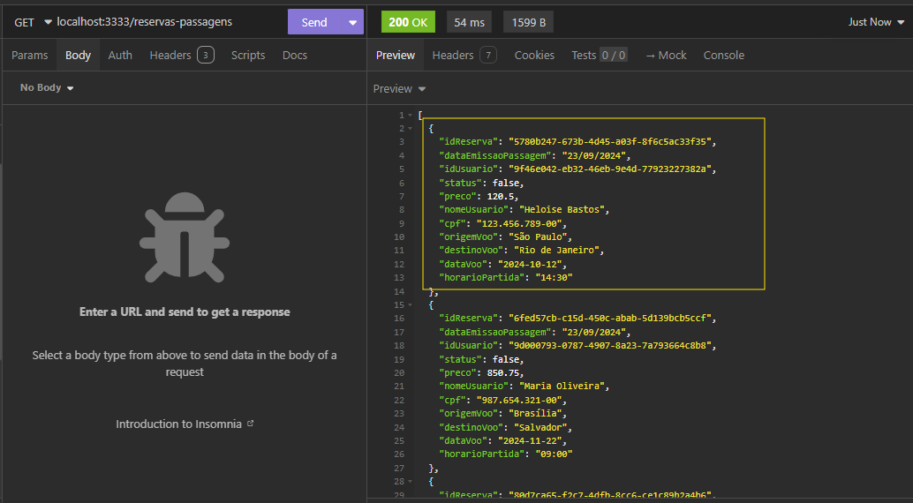
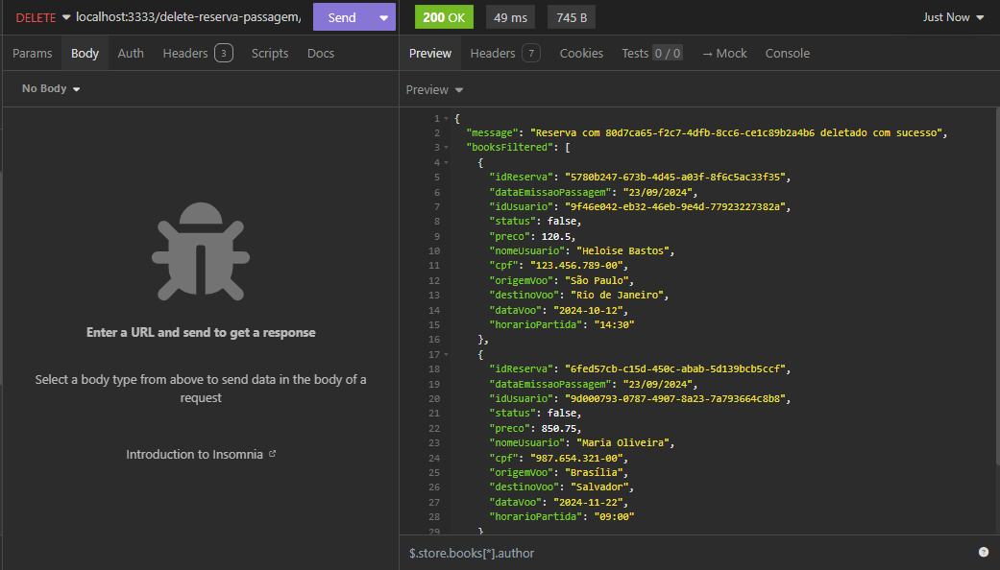

# API Reserva de Passagem Aérea 

## Descrição

A API Reserva de Passagem Aérea é uma aplicação desenvolvida em TypeScript utilizando Node.js e Express. Esta API permite realizar operações básicas, como criar, editar e buscar reserva de passagem, com os dados sendo armazenados temporariamente na memória da aplicação.

O projeto adota uma estrutura modular para facilitar a manutenção e escalabilidade, garantindo que cada parte da aplicação seja organizada em camadas separadas, como interface, application, infrastructure e domain. Essa abordagem melhora a legibilidade do código e permite a expansão eficiente da aplicação. Utilizamos a arquitetura Clean, aplicando o padrão Factory e o padrão Singleton para gerenciar a criação e instância de objetos. Além disso, o projeto segue os princípios da Programação Orientada a Objetos (POO) e implementa DDD (Domain-Driven Design) para garantir que a lógica de negócio esteja centralizada e bem estruturada. Também aplicamos os princípios SOLID para assegurar que o código seja flexível, reutilizável e de fácil manutenção.

## Tecnologias, Framework e Ferramentas

- [Node.js](https://nodejs.org/en)
- [Express](https://expressjs.com/)
- [Insomnia](https://insomnia.rest/download)
- [IDE VSCODE](https://code.visualstudio.com/download)
- [TypeScript](https://www.typescriptlang.org/)
### Testando a API Reserva de Passagem

Os passos necessários para testar localmente são:

- Instalar as ferramentas necessárias
- Clonar o projeto
- Executar o seguintes comandos na raiz do diretório

  instala pacotes do framework Express e do Nodemon para reiniciar automaticamente o servidor.
  ```plaintext
    npm i express nodemon
    npm install typescript ts-node-dev @types/node @types/express
   ```
 
  Executa o script start definido no package.json, utilizado para iniciar o servidor. 
  ```plaintext
    npm i start
   ```
- Testar as rotas da API e JSON com as requisições

### Rotas da API Post Refatorado 

| Método | Rota                                | Função                                            |
| ------ | ----------------------------------- | ------------------------------------------------- |
| POST   | /reservar-passagem   /                  | Operação para criar uma nova reserva                 |
| GET    | /reservas-passagens                | Operação buscar todas as reservas de passagens cadastradas       |
| PATCH    | /atualiza-reserva-passagem/:id   | Operação para editar a reserva de passagem por id        |
| DELETE    | /delete-reserva-passagem/:id          | Operação para deletar a reserva de passagem por id        |


#### [POST] /reservar-passagem
- **Descrição**: Operação de cadastro de um nova reserva de passagem. Requer o envio dos dados do post pelo body.

```plainttext
localhost:3333/reservar-passagem
```
- **Exemplo de body**:

```json
{
  "status": true,
  "preco": 1450.00,
  "nomeUsuario": "Heloíse Bastos",
  "cpf": "654.321.987-00",
  "origemVoo": "João Pessoa",
  "destinoVoo": "São Paulo",
  "dataVoo": "2024-12-10",
  "horarioPartida": "18:45"
}
```


#### [GET] /reservas-passagens
- **Descrição**: Operação  para buscar de todas as reservas cadastradas

```plaintext
localhost:3333/reservas-passagens
```


#### [PATCH] /atualiza-reserva-passagem/:id

- **Descrição**: Operação para editar uma reserva de passagem específica por meio do id cadastrado

```plaintext
 localhost:3333/atualiza-reserva-passagem/:id
```




#### [DELETE] /delete-reserva-passagem/:id

- **Descrição**: Operação para deletar uma reserva de passagem específica por meio do id cadastrado

```plaintext
localhost:3333/delete-reserva-passagem/:id
```


## Estrutura do projeto

```plaintext
📂api-reserva-passage-aerea
└──📂src
    └──📂interface
        └──📄 index.ts
        └──📄reserva-passagem-controller.ts
    └──📂infrastructure
        └──📂database
              └──📄 repository.ts
        └──📂utils
              └──📄 config.ts
              └──📄 id-gerenator.ts
    └──📂applications
         └──📂repositories
            └──📄id-generation-interfaces.ts
            └──📄reserva-passagem-repository.ts
         └──📂use-cases
            └──📄create-reserva-passagem-use-case.ts
            └──📄delete-reserva-passagem-use-case.ts
            └──📄list-all-reserva-passagem-use-case.ts
            └──📄update-reserva-passagem-use-case.ts
    └──📂domain
        └──📄reserva-passagem.ts
└──📂node_modules
└──📄 package-lock.json
└──📄 package.json
└──📄 .tsconfig.json
└──📄 .jest.config.js
└──📄 .gitigonore
└──📄 Readme.md


