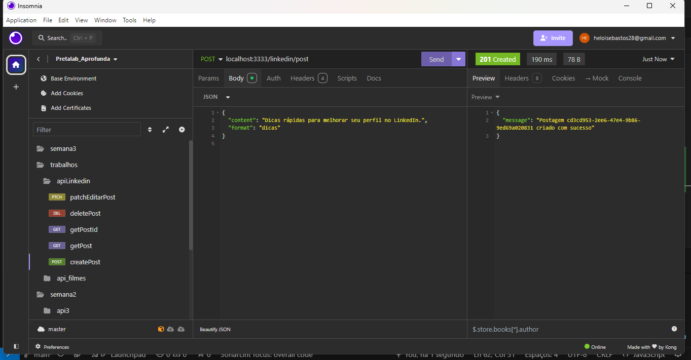
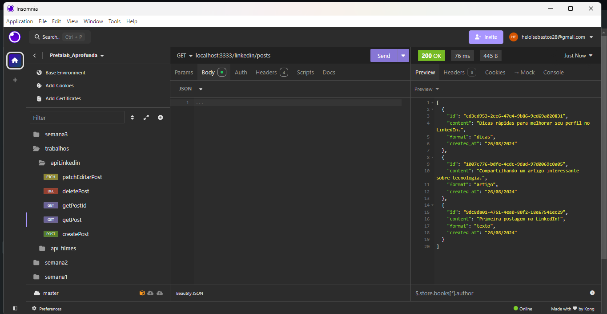
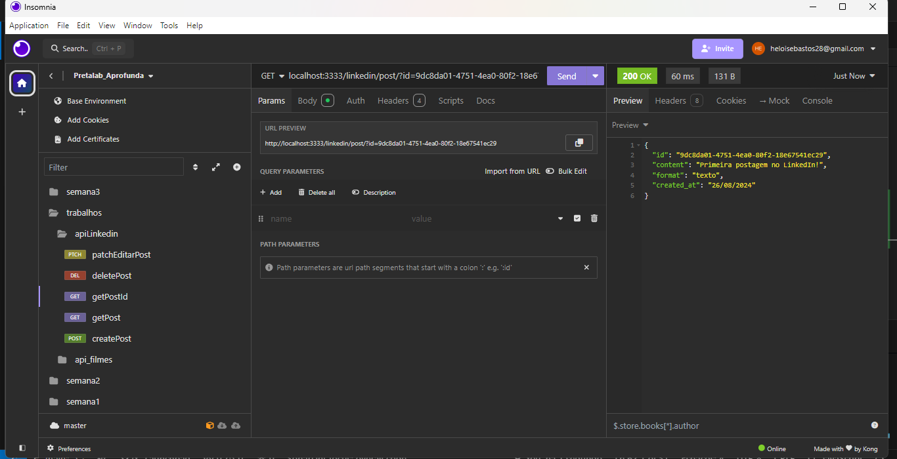
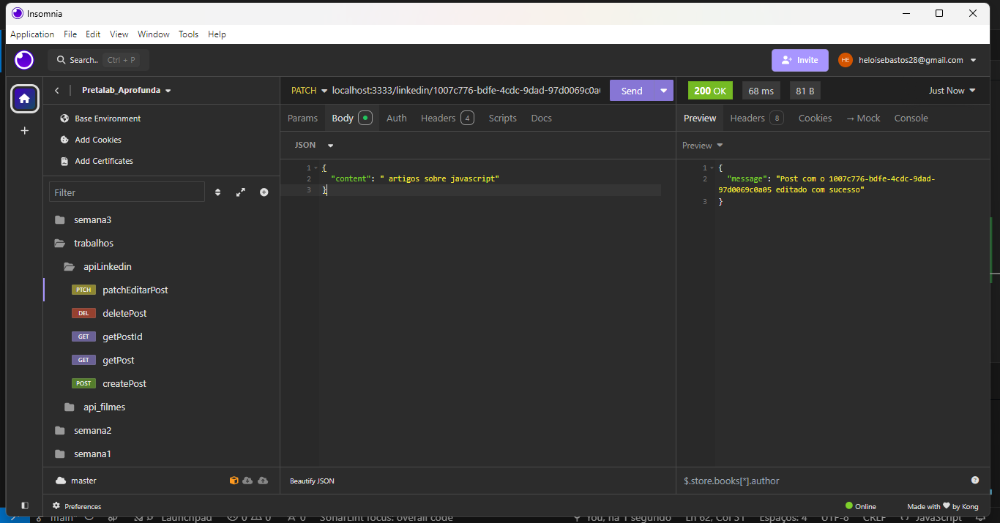
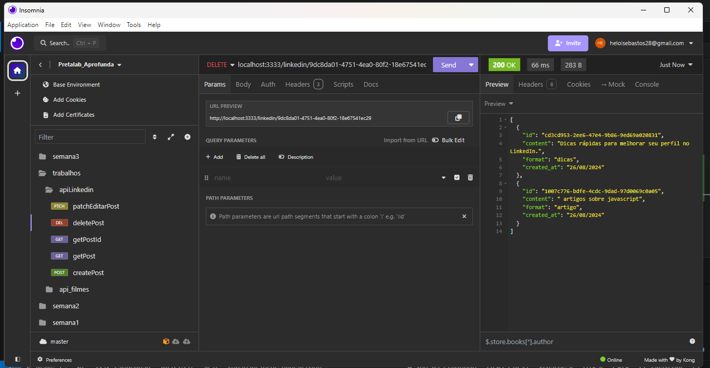

# API Linkedin

## Descrição

O projeto API Posts no Linkedin é uma aplicação desenvolvida em JavaScript utilizando Node.js e Express. Esta API permite realizar operações básicas criar, editar e buscar um conjunto de posts armazenados temporariamente na memória da aplicação.

## Tecnologias, Framework e Ferramentas

- [JavaScript](https://www.javascript.com/)
- [Node.js](https://nodejs.org/en)
- [Express](https://expressjs.com/)
- [Insomnia](https://insomnia.rest/download)
- [IDE VSCODE](https://code.visualstudio.com/download)

### Testando a API Posts no Linkedin

Os passos necessários para testar localmente são:

- Instalar as ferramentas necessárias
- Clonar o projeto
- Executar o seguintes comandos na raiz do diretório

  instala pacotes do framework Express e do Nodemon para reiniciar automaticamente o servidor.
  ```plaintext
    npm i express nodemon
   ```
  instala o Cors pacote que gerencia permissões de acesso ao recurso do servidor.
  ```plaintext
    npm i cors
   ```
  Executa o script start definido no package.json, utilizado para iniciar o servidor. 
  ```plaintext
    npm i start
   ```
- Testar as rotas da API e JSON com as requisições

### Rotas da API Posts no Linkedin (/linkedin)

| Método | Rota                                | Função                                            |
| ------ | ----------------------------------- | ------------------------------------------------- |
| POST   | /linkedin/post                          | Operação de cadastro de novo post                 |
| GET    | /linkedin/posts                      | Operação buscar todos os posts cadastrados       |
| GET    | /linkedin/post/?id=                      | Operação buscar o post por id        |
| PATCH    | /linkedin/                     | Operação editar o post por id        |
| DELETE    | /linkedin/                     | Operação deletar o post por id        |


#### [POST] linkedin/post

- **Descrição**: Operação de cadastro de um novo post. Requer o envio dos dados do post pelo body.

- **Exemplo de body**:

```json
{
  "content": "Primeira postagem no LinkedIn!",
  "format": "texto"
}


```


#### [GET] /linkedin/posts

- **Descrição**: Operação  para buscar de todos os posts cadastrados

```plaintext
  localhost:3333/linkedin/posts
```


#### [GET] /linkedin/post/?d=

- **Descrição**: Operação para buscar post por id 

```plaintext
  localhost:3333/linkedin/post/?id=
```


#### [PATCH] /linkedin/

- **Descrição**: Operação para editar um post por meio do id cadastrado

```plaintext
  localhost:3333/linkedin/
```


#### [DELETE] /linkedin/

- **Descrição**: Operação para deletar um post por meio do id cadastrado

```plaintext
localhost:3333/linkedin/
```


## Estrutura do projeto

```plaintext
📂api_linkedin
└──📂 node_modules
└──📂 imagens_insomnia
└──📄  server.js
└──📄 package-lock.json
└──📄 package.json
```
