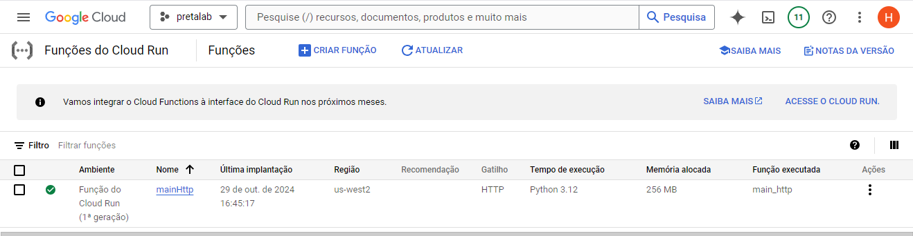
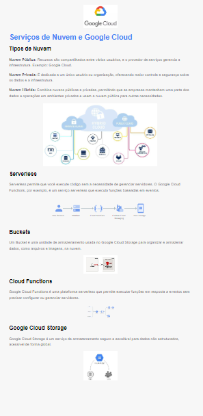

# Provisionamento com Google Cloud Platform, Google Cloud Function e Terraform 

## Descrição

Este projeto tem como objetivo provisionar uma infraestrutura no Google Cloud Platform usando Terraform.


### Tecnologias Utilizadas

- [**Google Cloud** ](https://cloud.google.com/)
- [**Google Cloud Fuction**](https://cloud.google.com/blog/products/serverless/google-cloud-functions-is-now-cloud-run-functions)
- [**Terraform**](https://registry.terraform.io/providers/hashicorp/google/latest/docs)


## Estrutura do Projeto


```plaintext
📂atividade-googlecloud-functions
   📂function
    └──📄 main.tf
    └──📄 variables.tf
    └──📄 outputs.tf
    └──📄 main.py
    └──📄 requirements.txt
    └──📄 .gitignore
    └──📄 terraform.tfvars
    └──📂 function.zip
 📂imagens
 📄Readme.md

```

- O `main.tf` é o arquivo principal do Terraform, onde são definidos todos os recursos que serão provisionados. Ele inclui a configuração do provedor Google, o bucket para armazenamento do código da função, o arquivo ZIP com o código compactado e a configuração da Cloud Function propriamente dita.

- O `variables.tf` define as variáveis usadas no `main.tf`. Elas ajudam a parametrizar o código, facilitando sua personalização e reutilização.

- O `outputs.tf` contém as saídas de dados que queremos obter após o provisionamento dos recursos. 

- O `main.py` contém o código da Cloud Function em Python. Ele define a lógica da função que será executada no GCP. O ponto de entrada da função é configurado no `main.tf`, e o código no `main.py` realiza as operações desejadas, como processar uma solicitação HTTP e retornar uma resposta.

- O `requirements.txt` lista todas as dependências da função. No deploy da Cloud Function, o GCP usa este arquivo para instalar as bibliotecas Python necessárias para que o código funcione corretamente.

- O `.gitignore` lista os arquivos e diretórios que não devem ser incluídos no controle de versão. Geralmente, ele inclui arquivos como `terraform.tfstate`, `function.zip` e outros arquivos sensíveis ou temporários gerados durante o processo de provisionamento e deploy.

- O `terraform.tfvars` armazena valores específicos para as variáveis definidas em `variables.tf`. Este arquivo permite configurar variáveis de forma centralizada, especialmente útil para gerenciar dados sensíveis, como o ID do projeto ou outras informações que podem variar entre ambientes.

- O `function.zip` é o arquivo compactado que contém o código da função e as dependências. Ele é carregado no Google Cloud Storage e, em seguida, referenciado no `main.tf` para ser usado no deploy da Cloud Function.


## Comandos Terraform

Para executar o processo de provisionamento, usamos os seguintes comandos :

1. Este comando compacta o main.py (o código da função) e o requirements.txt (dependências) em um único arquivo ZIP chamado function.zip, pronto para ser carregado no bucket do Google Cloud Storage.
```
zip -r function.zip main.py requirements.txt
```

2. Para inicializar o Terraform, preparando o ambiente para criação dos recursos.

```
terraform init
```

3. Para exibir um plano de execução, mostrando os recursos que serão criados.

```
terraform plan
```

4. Para aplicar as mudanças, criando todos os recursos definidos no `main.tf`.

```
terraform apply
```

## Resultados Obtidos 

Essa estrutura foi implementado com objetivo de estudar o deploy e o gerenciamento do Function no GCP com Terraform. O objetivo era entender na prática o funcionamento Terraform para provisionar uma Cloud Function para reduzir o trabalho manual, tornando o processo de deploy mais rápido e seguro.

1. Imagem do bucket criado para armazenamento do código do function
.png)

2. Imagem interface do Google Cloud Functions


3. Imagem da página gerada pelo function (resposta HTTP gerada pela função implementada )


<p align="center">
    
</p>

4. Interface do Google Cloud Functions - Métricas


