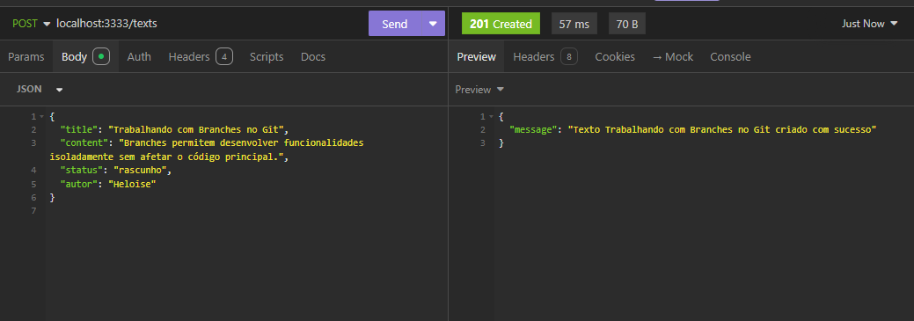
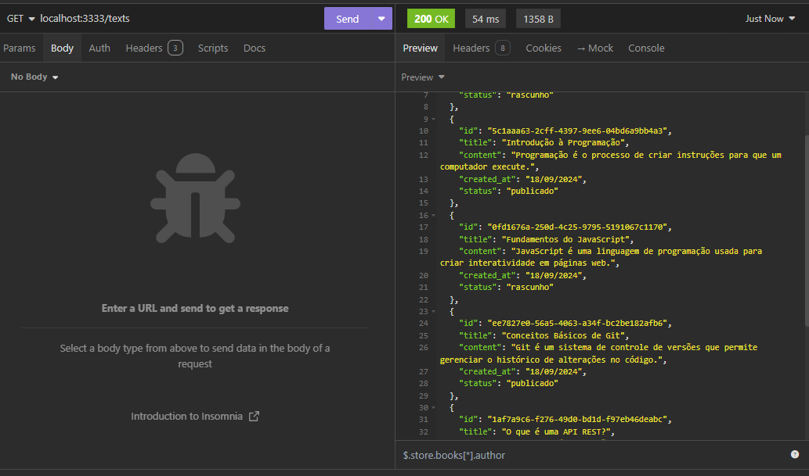
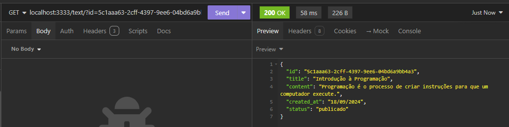
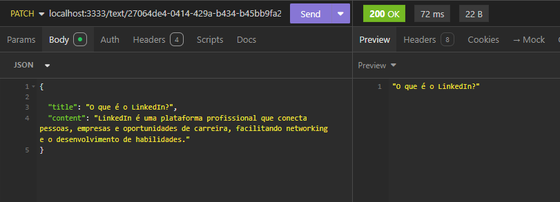
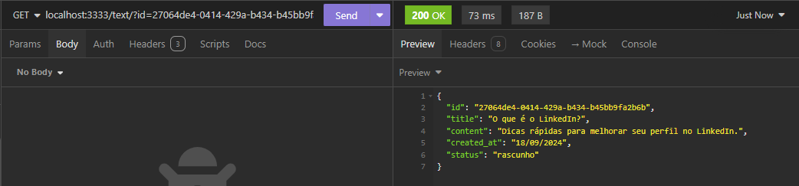
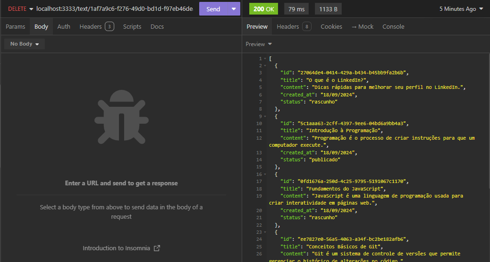

# API Blog 

## Descrição

O API Blog Refatorado é uma aplicação desenvolvida em JavaScript utilizando Node.js e Express. Esta API permite realizar operações básicas, como criar, editar e buscar posts, com os dados sendo armazenados temporariamente na memória da aplicação.

O projeto adota uma estrutura modular para facilitar a manutenção e escalabilidade, garantindo que cada parte da aplicação seja organizada em camadas separadas, como rotas, controladores, serviços e modelos. Essa abordagem melhora a legibilidade do código e permite a expansão eficiente da aplicação.

## Tecnologias, Framework e Ferramentas

- [JavaScript](https://www.javascript.com/)
- [Node.js](https://nodejs.org/en)
- [Express](https://expressjs.com/)
- [Insomnia](https://insomnia.rest/download)
- [IDE VSCODE](https://code.visualstudio.com/download)

### Testando a API Blog

Os passos necessários para testar localmente são:

- Instalar as ferramentas necessárias
- Clonar o projeto
- Executar o seguintes comandos na raiz do diretório

  instala pacotes do framework Express e do Nodemon para reiniciar automaticamente o servidor.
  ```plaintext
    npm i express nodemon
   ```
  instala o Cors pacote que gerencia permissões de acesso ao recurso do servidor.
  ```plaintext
    npm i cors
   ```
  Executa o script start definido no package.json, utilizado para iniciar o servidor. 
  ```plaintext
    npm i start
   ```
- Testar as rotas da API e JSON com as requisições

### Rotas da API Post Refatorado 

| Método | Rota                                | Função                                            |
| ------ | ----------------------------------- | ------------------------------------------------- |
| POST   | /texts                          | Operação de criar de novo post                 |
| GET    | /texts                      | Operação buscar todos os posts cadastrados       |
| GET    | /text                      | Operação buscar o post por id        |
| PATCH    | /text/:id                     | Operação editar o post por id        |
| DELETE    | /text/:id                     | Operação deletar o post por id        |


#### [POST] /texts 

- **Descrição**: Operação de cadastro de um novo post. Requer o envio dos dados do post pelo body.

- **Exemplo de body**:

```json
{
  "title": "Conceitos Básicos de Git",
  "content": "Git é um sistema de controle de versões que permite gerenciar o histórico de alterações no código.",
  "status": "publicado",
  "autor": "Heloise"
}


```


#### [GET] /texts  

- **Descrição**: Operação  para buscar de todos os posts cadastrados

```plaintext
  localhost:3333/texts/posts
```


#### [GET]  /text  
- **Descrição**: Operação para buscar post por id 

```plaintext
  localhost:3333/text/?id=
```


#### [PATCH] /text/:id

- **Descrição**: Operação para editar um post por meio do id cadastrado

```plaintext
  localhost:3333/text/:id
```




#### [DELETE] /text/:id

- **Descrição**: Operação para deletar um post por meio do id cadastrado

```plaintext
localhost:3333 /text/:id
```


## Estrutura do projeto

```plaintext
📂blog_refatorado
└──📂src
    └──📂routes
        └──📄blogRoutes.js
    └──📂controllers
        └──📄blogController.js
     └──📂services
        └──📄textFactory.js
        └──📄textService.js
    └──📂models
        └──📄Text.js
    └──📂utils
        └──📄textStoragy.js
```
